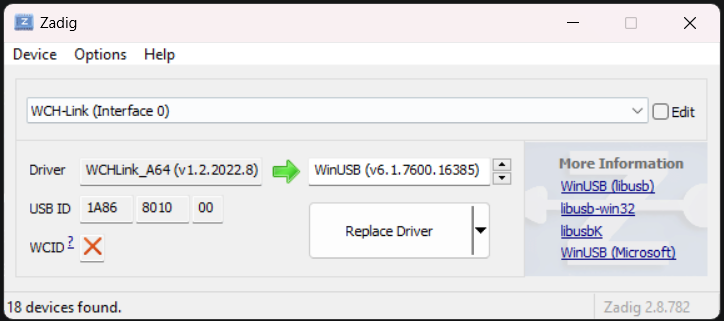

# Driver Replacement

### Link:
https://github.com/AlexanderMandera/arduino-wch32v003/wiki/Additional-Installation-Steps

### Steps:
1, Install Zadig: https://zadig.akeo.ie/
2, plug the WCH-LINKE to the computer
3, Open Zadig > Select Options > List all Devices
4, select WCH-Link (Interface 0)
5, Click Replace Driver

### Flash Command:
pio run -e esp_mess_addon -t upload

### Unbrick device:
pio run -e esp_mess_addon -t upload -u 