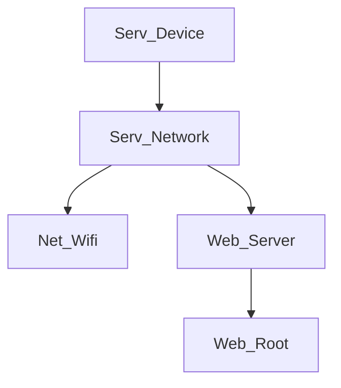

### IGNORE the stuff below. They are just notes for myself.
need to create
src/1Configs/Conf_User.h:
#define MY_SSID "YOUR_WIFI_SSID"
#define MY_PASS "YOUR_WIFI_PASSWORD"

### npm install
https://nodejs.org/en
cmd: npm install -g live-server
cmd: live-server
Run PowerShell as Administrator
cmd: Set-ExecutionPolicy Unrestricted
answer: Y

### plugins
https://serial.huhn.me/

PlatformIO IDE
Better Comments
REST Client
Serial Monitor
Live Preview
Live Server

### General Shortcuts
Ctrl+C/V: Copy/Paste
Ctrl+S/O: Save/Open
Ctrl+W: Close Tab or Window
Ctrl+Z: Undo
Ctrl+F: Find
Ctrl+A: Select All
Ctrl+N: New Window

Alt+Tab: Switch between windows
Win+Left/Right: Snap-in window (in Multitasking turn off checkboxes)
Win+Number: Switch between apps in order
Win+S: Search
Win+X: Secret Start Menu
Win+E: File Explorer
Win+D: Minimize All

### Browser Shortcuts
Ctrl+T: New Tab 
Ctrl+Number: Switch tab Number

### YouTube Shortcuts
up/down: increase/decrease volume
left/right: Seek back and forth
Shift+<: reduce playback rate
Shift+>: increase playback rate
Spacebar: Play/Pause
c: caption on or off
i: open mini player
Shift+N: next video
Shift+P: previous video

### VsCode Shortcuts
Ctrl+/: Comment out Selected
Ctrl+Click: click on variable or method to see definitions
Ctrl+G: Goto line
PlatformIO: Ctrl+Alt+U: Upload code

### Window Screenshots
Snipping Tools: Search for Snipping Tools app
Snipping & Sketch: Win+Shift+S

### PiHole Blocklists
https://firebog.net/

### App Flow

https://github.com/SensorsIot/IOTstack/blob/master/docs/Containers/InfluxDB.md#authentication

### Extra
CH32V Setup
link: https://taunoerik.art/2023/08/05/programming-ch32v003/
link: https://www.wch-ic.com/products/WCH-Link.html

burning tool: https://www.wch.cn/downloads/file/418.html?time=2023-10-19%2022:06:13&code=z5CifoTC1ie3Nqxv8Wvr5IrsQdtDa9sBWsguVl6r

PlatformIO Install
PIO Home -> Platforms -> Advanced platform installation
Add Url: https://github.com/Community-PIO-Ch32v/platform-ch32v
pinOut: https://raw.githubusercontent.com/Tengo10/pinout-overview/main/pinouts/CH32v003/ch32v003j4m6.svg

https://github.com/Community-PIO-CH32V/platform-ch32v/blob/develop/boards/genericCH32V003J4M6.json
pio run -e ws2812bdemo
pio run -e ws2812bdemo -t upload
