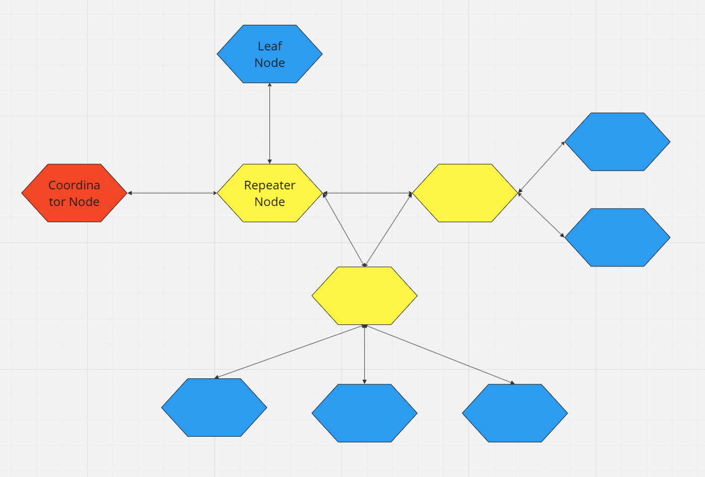
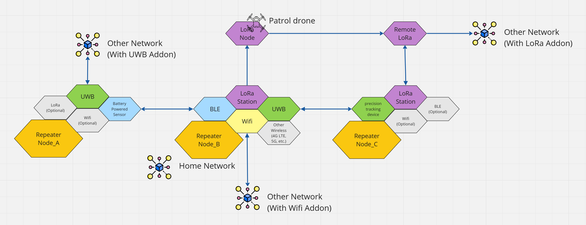

# ESP-MESS Network Topology

## Types of Nodes

Figure 1. The 3 types of Nodes

An ESP-MESS Network consists of 3 types of nodes:

1. Coordinator Node
   is a device that plays a central role in managing and controlling the network. It is responsible for organzing communcation between nodes, maintaining network topology, and ensuring efficient data transfer within the network. Key responsibilities of a Coordinator Node include: 
      - Network Formation: The coordinator assists in forming the network by allowing nodes to join and configuring the network topology.
      - Security: The coordinator may implement security measures, such as encryption and authentication, to protect the integrity and confidentiality of data within the network.

2. Repeater Node
   is a device that facilitates the routing of data between nodes within the network. Unlike traditional networks where data typically flows through a central router, the networks distribute the routing functionality across multiple nodes. Each node in a the network, including the Repeater Nodes, acts as both a data source and a potential relay point for other nodes. Key characteristics and functions of a Repeater Node in the network include:
      - Routing and Synchronization: Repeater nodes determine the best path for data to travel from the source node to the destination node within the the network. They make dynamic routing decisions based on the current network conditions, ensuring efficient and reliable data transfer. They synchronize communication timing among nodes to avoid collisions and optimize the use of available bandwidth.
      - Relaying: Nodes can communicate directly with each other or relay data through intermediate nodes to reach the destination. Repeater nodes often serve as relays, forwarding data between nodes that are not in direct radio range of each other.
      - Topology Maintenance: Repeater Nodes contribute to maintaining the overall network topology by sharing information about neighboring nodes, signal strength, and link quality. This information helps optimize routing decisions.
      - Dynamic Adaptation: The networks are designed to be self-healing and adaptive. If a node fails or the network topology changes, Repeater Nodes can dynamically adapt their routing paths to ensure continued connectivity.

3. Leaf Node (End device)
   refers to a device that typically serves as the endpoint or source/destination of data within the network. Unlike Repeater Nodes, which participate in the routing of data and may act as relays, Leaf Nodes primarily generate or consume data without actively participating in the network's routing infrastructure. Key characteristics of Leaf Nodes in the network include:
      - Data Source/Destination: Leaf Nodes are the originators or ultimate recipients of data in the network. Examples of a Leaf Node include sensors, actuators, smartphones, laptops, or any other devices that generate or consume data.
      - Limited Routing Functionality: Leaf Nodes in the network usually have limited or no routing functionality. They rely on the the network infrastructure, including Repeater Nodes, to facilitate the routing of data between source and destination.
      - Low Power Consumption: Some Leaf Nodes, especially those powered by batteries, are designed to operate with low power consumption. These devices may use power-efficient communication protocols and may enter sleep modes to conserve energy when not actively transmitting or receiving data.

## Notes and Usages

### Leaf Nodes

Figure 2. An example of a network of Leaf Nodes and Repeater Nodes. A remote button or a motion detector sensors under the Repeater Node_A can be used to trigger the smart light switch under Node_A network but can also be relayed to control other devices on Node_B network and vise versa.

Leaf Nodes are designed to operate on batteries for an extended period using power-efficient wireless technologies, optimized circuits, sleep modes, wake-on-event, and energy harvesting. They are not neccessary low powered devices only. They serve as end devices within the ESP-MESS network, meaning they don't send data to other Leaf Nodes. The key distinction from Repeater Nodes lies in the fact that the network concludes at the Leaf Node. If a device processes data from another Leaf Node directly, it is not considered a Leaf Node. This characteristic helps identify the type of a device and defines it's access level.

### Key Uses:
- Low Power Sensor Nodes: Equipped with sensors to collect environmental data such as temperature, humidity, air quality, pressure, proximity, accelerometer, etc.

- Remote Controllers: Devices that emit signals based on actions or events, e.g., a button to control lights, a reed switch signaling door movement, or a motion detector triggering an event.

- Notes*: Leaf Nodes can function as both Sensor Nodes and/or Remote Controllers. Note that the ability to collect sensor readings or trigger events is not exclusive to Leaf Nodes but is an attribute of the node type.

### Repeater Nodes

Figure 3. An example that demonstrate various posible configurations of Repeater Nodes.

Repeater Nodes are often run on electrical power because they have higher energy requirements and consume more power during operation because they are usually required to stay active to listen to signals from Leaf Nodes. However, they can be designed to go to sleep if necessary to save energy. These nodes may also run on batteries with energy harvesters like wind turbines or solar panels. They have more functionalities comparing to a Leaf Node which enable them to manage and maintain the network topology. Repeater Nodes can talk to each other directly unlike the Leaf Nodes, which can only send data to each other through a Repeater Node. 

#### Key Uses:
- Versatile Roles: Repeater Nodes can function as Sensor Nodes or Remote Controllers.

- Data Storage: They retrieve and store data from designated Leaf Nodes or other Repeater Nodes.

- Network Extension: Repeater Nodes expand network reach and coverage.

- Distributed Computing and Redundancy: These nodes facilitate resource sharing among network devices. For example, Real-Time Clock (RTC) modules help maintain time during power outages, with multiple devices equipped with RTC modules ensuring network time continuity.

- Network Bridge: Repeater Nodes act as bridges between different wireless technologies. For instance, they enable communication between a BLE remote controller and a WiFi smart plug by processing and converting signals, allowing for the use of low-power wireless technologies where necessary.

### Coordinator Nodes
Coordinator Nodes serve as the primary entities responsible for establishing network identity and configuring network settings. They contribute to network isolation by defining the network key, which is distributed to all devices within the same network, facilitating communication among them. Networks can be configured with multiple Coordinators, and the assignment of Coordinators can be tailored based on security needs.

In stringent networks, access to at least one designated Coordinator is required to modify network configurations. If access to all designated Coordinators is lost, a physical reset and reconfiguration of all devices are necessary to change their settings. Conversely, in a more lenient network, any Repeater Node can become a Coordinator whenever accessed by the user.

#### Key Uses:
- Network Designation: Coordinator Nodes initiate and update the network key, ensuring that devices within the same network can communicate using the provided key.

- Network Isolation: Coordinator Nodes aid in isolating networks, allowing for segmentation that enhances access control and security measures.