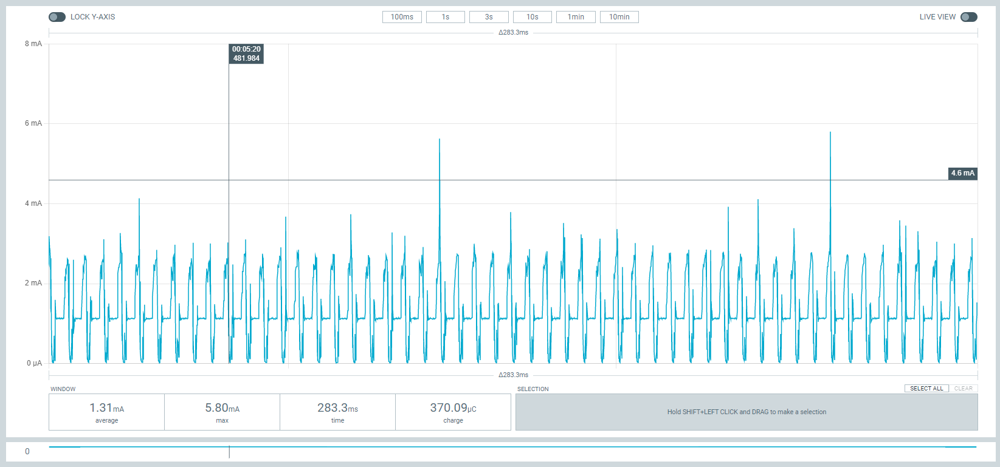
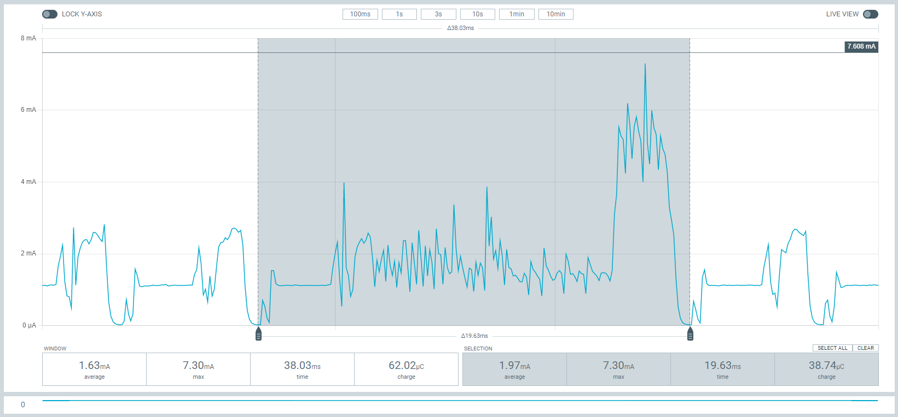
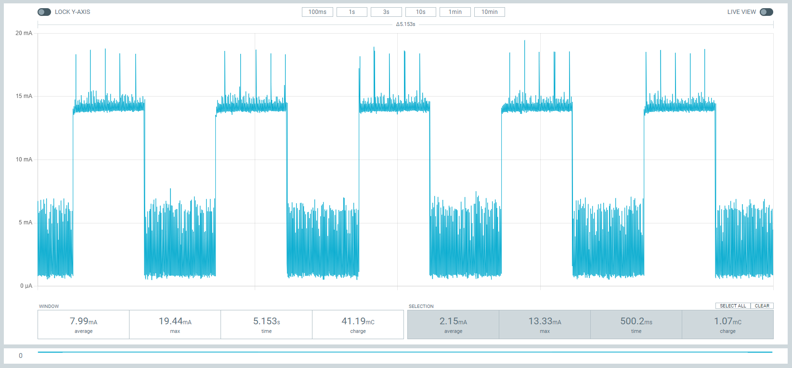
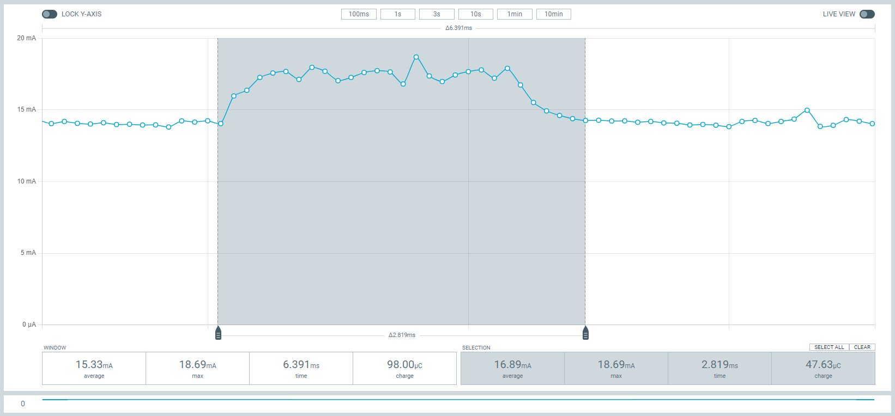
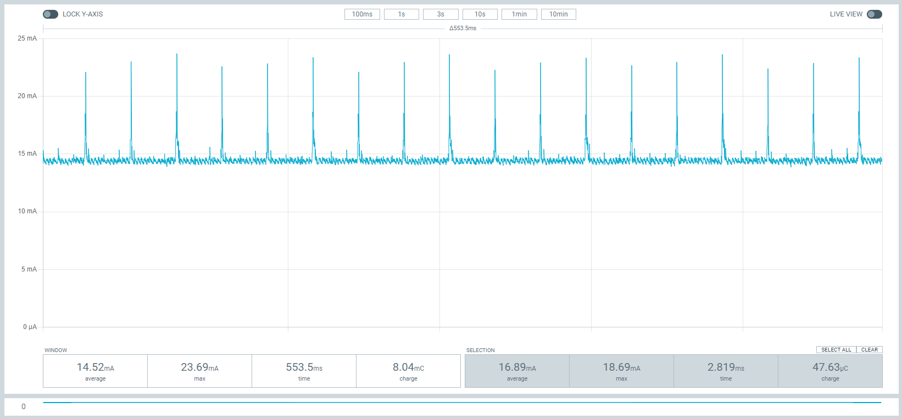
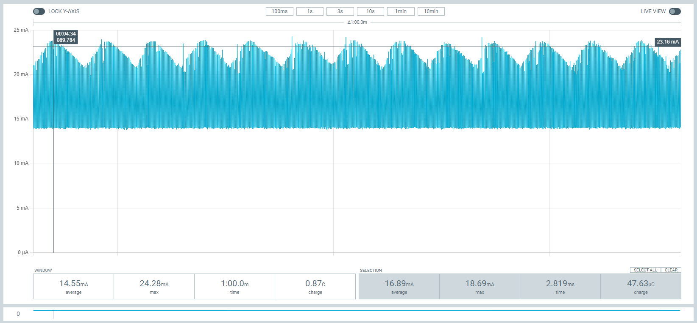

# JDY-25

### Links
https://github.com/Edragon/JDY-MESH/tree/main/JDY-25M/HDK-EN

### Commands
#### Basics
default Baudrate: 9600. Line ending: \r\n

- AT 
- AT+RESET 
- AT+VERSION 
- AT+LADDR 
- AT+NAME(18 bytes max) 
- AT+PIN(4 bit password) 
- AT+TYPE(0 no password, 1 password no binding, 2 password with binding) 
- AT+BAUD(rate: 4 for 9600, 8 for 115200) 
- AT+DISC 
- AT+STAT (0 unconnected, 1 connected, 2 networked, 3 connected and networked) 
- AT+DEFAULT 
- AT+ENLOG(1 enable, 0 disable) 
- AT+SLEEP(mode: 1=LightSleep, 2=DeepSleep no broadcast) 

#### Configurations
- AT+ROLE(0=transparent, 1=master, 2=BLE broadcast, 3=iBeacon, 4=iBeacon probe, 5=MESH, 6=Multi-connected slave/4 masters connections, 7=Multi-connected master/slave master supports to connect 4 slaves at the same time, and slave supports to connect 4 masters, 8=Keylabel) 
- AT+POWR(value: 0=-15dBm, 1=-0dBm, 2=2dBm, 3=3dBm, 4=4dBm) 
- AT+ADVIN(delay: 1=100ms, 2=200ms, 3=300ms, 4=500ms, 6=1s, 7=1.5s, 8=3s, 9=60s) 
- AT+STARTEN(mode: 1 power on wakeup, 0 power on sleep/connect wakeup/disconnect sleep) 
- AT+INQ(scanDur: 0=2secs, 1=4secs, 2=6secs, 3=8secs, 4=16secs) 
- AT+KEY(ioInput: 1-5, target: 000-ffff, ioOutput: 1-5, serialoutput: 1=enable 0=disable) 
- AT+NETID(0000-ffff) 
- AT+MADDR(0001-ffff) 
- AT+MCLSS(type: 0=router, 1=terminal) 
- AT+FRIEND(Mac hex) 
- AT+CLRFRIEND 
- AT+FRTYPE(type: 0=private, 1=open) 
- AT+IBUUID(Hex UUID) 
- AT+MAJOR(0000-ffff) 
- AT+MINOR(0000-ffff) 
- AT+IBSING(00-ff) 
- AT+FUNC 
- AT+SUBTYPE(1 Key and Output associated, 0 Key and output NOT associated) 
- AT+LEARN(enable: 1=on, 0=off) 
- AT+LEAVAL(output: 1-5, input: 1-5, code sender short address) 
- AT+DEVCLSS(f1 one key binding function is turn on - in ROLE1mode support pressing PWRC pin to bind and connect to the strongest signal slave nearby) 
- AT+KLABEL(label: 0-9, ioNumber: 1-5, Mac Addr) 
- AT+KLTIME(label: 0-9, overtime: 0-9) 
- AT+KLRSSI(label: 0-9, sensitivity: 00-99) 

#### Connection
- AT+STOP(NOT WORKING?) 
- AT+CONN(target: 0-7) 
- AT+CONA(target: Mac hex) 
- AT+BAND(target: Mac hex) 
- AT+CLRBAND 
- AT+SRBAND 
- AT+MESH(Hex data) 
- AT+DATA(masterId: 1-4, data) 
- AT+CUIO(ioOutput: 1-5) 
- AT+TGIO(ioOutput: 1-5, value: 1=On, 2=Off) 

### Observed Behaviors
1. Deep Sleep no broadcast (mode 2):
   - repeated signals
   - average current draw 1.30mA.

2. Light Sleep (mode 1):
   - @-15dBm: beacon frame average 2.10mA, max 7.3mA, duration ~20ms.
   - @-0dBm: beacon frame average 2.3mA, max 10mA, duration ~18ms.
   - @4dBm: beacon frame average 2.5mA, max 13.6mA, duration ~22ms.
   - beacon interval 100ms @-15dBm: average current draw 1.44mA.
   - beacon interval 500ms @-15dBm: average current draw 1.34mA.
   - beacon interval 1000ms @-15dBm: average current draw 1.32mA.
   - beacon interval 200ms @4dBm: average current draw 1.42mA.

3. Active (No Connection):
   - active with beacon frames for 500ms then light sleep for 500ms.
   - @-15dBm: beacon frame average 17.3mA, max 18.5mA, duration ~2.7ms.
   - beacon interval 100ms @-15dBm: average current draw 8.17mA.
   - beacon interval 500ms @-15dBm: average current draw 8.17mA.
   - beacon interval 200ms @4dBm: average current draw 8.23mA.

4. Active (with Connection):
   - beacon interval 100ms @-15dBm:: average current draw 14.55mA.
   
3. Others:
   - has a lot of features
   - power consumption quite high comparing to JDY-23.
   - has MESH network feature

### Figures

Figure 1. Sleep Mode2 no broadcast.

Figure 2. Sleep Mode1.

Figure 3. Active mode with no connection.

Figure 4. Active mode with no connection beacon frame.

Figure 5. Connected state.

Figure 5. Connected state 1 minute window.