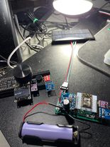
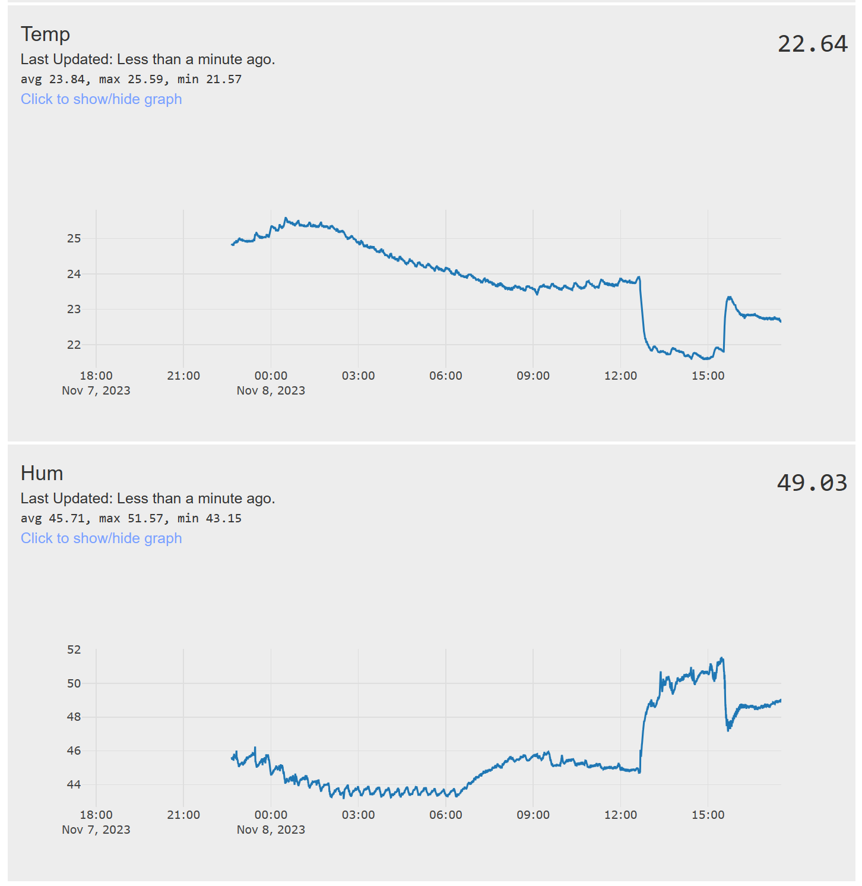
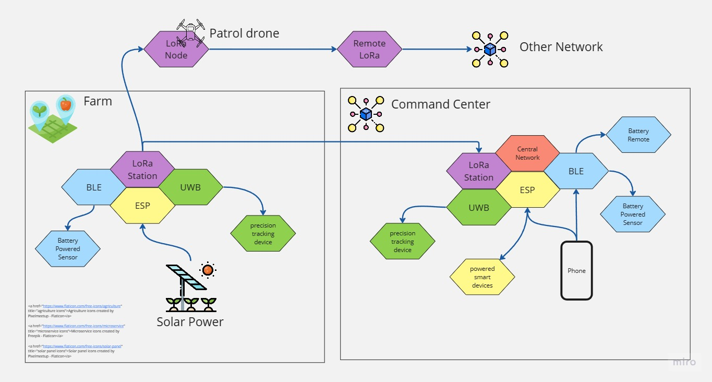

# What is it?
ESP-MESS is an open-source firmware for ESP8266 and ESP32 microcontrollers, enabling\
rapid IoT prototyping for home automation, smart farming, smart business, and more. 

## Why ESP-Mess? 
Back in 2020 during Covid, I got an opportunity to look back and decide on what I want to do next. I thought about what I liked as a kid so I decided to build a remote control car. While looking on Amazon for a micontroller to use, I stumbled upon the NodeMcu, a development board that house the ESP8266 module. I was not expecting much from a development board. I just didn't know something special has been awaited and since then I have learned to do solder, basic electronics, embedded  programming, web developments for microcontrollers, PCB design, and a variety of wireless communication technologies.

I am building a Wireless Bridge System that can manage multiple devices using a variety of wireless technologies. The system is designed to be flexible and scalable, allowing it to adapt to different wireless application requirements. My goal is to explore and discover different IoT applications while keeping the cost minimal. To achieve this, I created ESP-MESS.

## Why a Wireless Bridge System (WBSys)?
Because it's cool. It's very cool. Ok, seriously,
different wireless technologies have their own unique advantages and disadvantages. For instance, LoRa technology allows devices to communicate with each other over long distances, which is not possible with WiFi or Bluetooth. However, LoRa has a low data rate, which makes it unsuitable for transmitting large amounts of data such as videos or audios. On the other hand, UWB (Ultra Wide Band) technology has a short range but enables devices to be accurately positioned relative to another device (the claim is yet to be verified to be 10-30 cm). WiFi can stream a lot more data over the air compared to Bluetooth, but at the cost of higher power consumption, making it less suitable for battery-operated devices than Bluetooth or BLE. These are just a few examples of the advantages and disadvantages of different wireless technologies.

## Ok, so what can WBSys be used for?
WBSys is a Wireless Bridge System that enables users to extend, manage, monitor, and control networks of devices. The system can be configured to achieve specific goals, such as a Proof of Concept (POC). By supporting different wireless technologies, WBSys provides users with greater flexibility in selecting devices and configurations that best meet their requirements. ESP-MESS is an implementation of this system, and the supporting devices have been carefully selected based on their performance and price. This allows users to choose components that best fit their budgets while meeting their requirements.

checkout our discord channel: 
https://discord.com/channels/793348436475904022/858758498875342878

A Live ESP-MESS Node:
This is an ESP-MESS Node that runs on a Lithium-ion 18650 battery and a solar panel. The device records the temperature, humidity, ambient light level, battery voltage level, and the charging current from the solar panel. It utilizes ESP-Now to send a signal to another Node, which is connected to my WiFi network. This Node publishes the readings to IoTPlotter for storage and data analysis.
https://iotplotter.com/user/feed/627987619219815565

### A Solar Node

### Data visualization

 

# What is the vision?
### Below is the rough draft of the initial vision. Please excuse my English.

### An example a configuration

# what is the state of the project?
Right now it's functional but I have not finished document the setup. 
I will try to make a video with instructions on how to work it.

Currently I have got ESP-Now working and some work for the LoRa communication has completed.
Next step is to refine the ESP-Now, LoRa, and then add support for BLE.

### What am I working on right now?
Right now I'm testing a few BLE modules. I'm trying to measure the power consumption of different devices and comparing them with each other.
This way I can pick one that I think is best suited for a low power device that monitors different sensors readings.