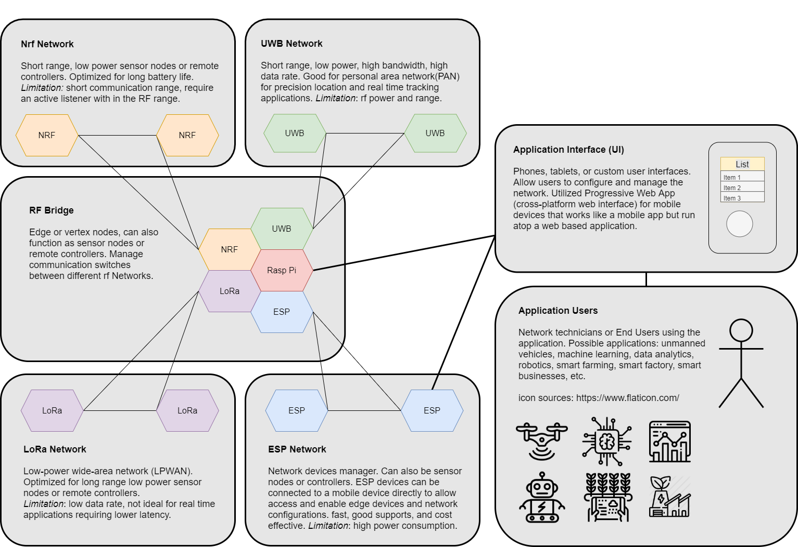
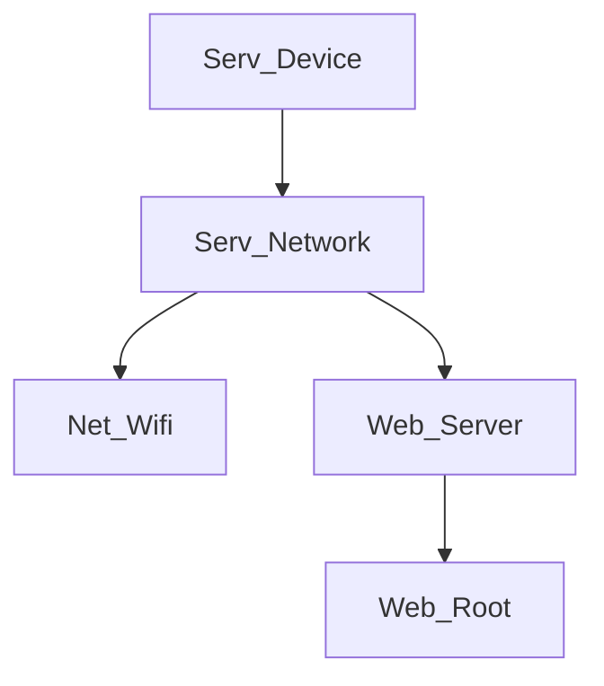

# esp_mess
esp_mess is an open-source firmware for ESP8266 and ESP32 microcontrollers, enabling\
rapid IoT prototyping for home automation, smart farming, smart business, and more. 

Why ESP-Mess? Back in 2020 during Covid, I got an opportunity to look back and decide\
on what I want to do next. I thought about what I liked as a kid so I decided to build\
a remote control car. While looking on Amazon for a good, ok, micontroller to use, I\
stumbled upon the NodeMcu, a development board that house the ESP8266 module.\
I didn't want to spend too much money on it so I was not expecting much paying some\
money for a module. I didn't know something special has been awaited and since then\
I have learned to do solder, basic electronics, embedded  programming, web developments\
for microcontrollers, PCB design, and a variety of wireless communication technologies.

I want to build a wireless bridge system, which can manage many devices using a wide\
range of different wireless technogies. The goal is have a system that is extendable\
and addative to different wireless application requirements. And use this as a mean\
to explore and discover different iOT applications. But at the same time, keep the\
cost minimal. Thus I created ESP-Mess.

checkout our discord channel: 
https://discord.com/channels/793348436475904022/858758498875342878

# below is the rough draft of the initial vision

# what is the state of the project?
Right now it's functional but I have not finished document the setup. 
I will try to make a video with instructions on how to work it.

Currently I have got ESP-Now working and some work for the LoRa communication has completed.
Next step is to refine the ESP-Now, LoRa, and then add support for BLE.

# IGNORE the stuff below. They are just notes for myself.
need to create
src/1Configs/Conf_User.h:
#define MY_SSID "YOUR_WIFI_SSID"
#define MY_PASS "YOUR_WIFI_PASSWORD"

# npm install
https://nodejs.org/en
cmd: npm install -g live-server
cmd: live-server
Run PowerShell as Administrator
cmd: Set-ExecutionPolicy Unrestricted
answer: Y

# plugins
https://serial.huhn.me/

PlatformIO IDE
Better Comments
REST Client
Serial Monitor
Live Preview
Live Server

# General Shortcuts
Ctrl+C/V: Copy/Paste
Ctrl+S/O: Save/Open
Ctrl+W: Close Tab or Window
Ctrl+Z: Undo
Ctrl+F: Find
Ctrl+A: Select All
Ctrl+N: New Window

Alt+Tab: Switch between windows
Win+Left/Right: Snap-in window (in Multitasking turn off checkboxes)
Win+Number: Switch between apps in order
Win+S: Search
Win+X: Secret Start Menu
Win+E: File Explorer
Win+D: Minimize All

# Browser Shortcuts
Ctrl+T: New Tab 
Ctrl+Number: Switch tab Number

# YouTube Shortcuts
up/down: increase/decrease volume
left/right: Seek back and forth
Shift+<: reduce playback rate
Shift+>: increase playback rate
Spacebar: Play/Pause
c: caption on or off
i: open mini player
Shift+N: next video
Shift+P: previous video

# VsCode Shortcuts
Ctrl+/: Comment out Selected
Ctrl+Click: click on variable or method to see definitions
Ctrl+G: Goto line
PlatformIO: Ctrl+Alt+U: Upload code

# Window Screenshots
Snipping Tools: Search for Snipping Tools app
Snipping & Sketch: Win+Shift+S

# PiHole Blocklists
https://firebog.net/

# App Flow

https://github.com/SensorsIot/IOTstack/blob/master/docs/Containers/InfluxDB.md#authentication

# Extra
CH32V Setup
link: https://taunoerik.art/2023/08/05/programming-ch32v003/
link: https://www.wch-ic.com/products/WCH-Link.html

burning tool: https://www.wch.cn/downloads/file/418.html?time=2023-10-19%2022:06:13&code=z5CifoTC1ie3Nqxv8Wvr5IrsQdtDa9sBWsguVl6r

PlatformIO Install
PIO Home -> Platforms -> Advanced platform installation
Add Url: https://github.com/Community-PIO-Ch32v/platform-ch32v
pinOut: https://raw.githubusercontent.com/Tengo10/pinout-overview/main/pinouts/CH32v003/ch32v003j4m6.svg

https://github.com/Community-PIO-CH32V/platform-ch32v/blob/develop/boards/genericCH32V003J4M6.json
pio run -e ws2812bdemo
pio run -e ws2812bdemo -t upload
